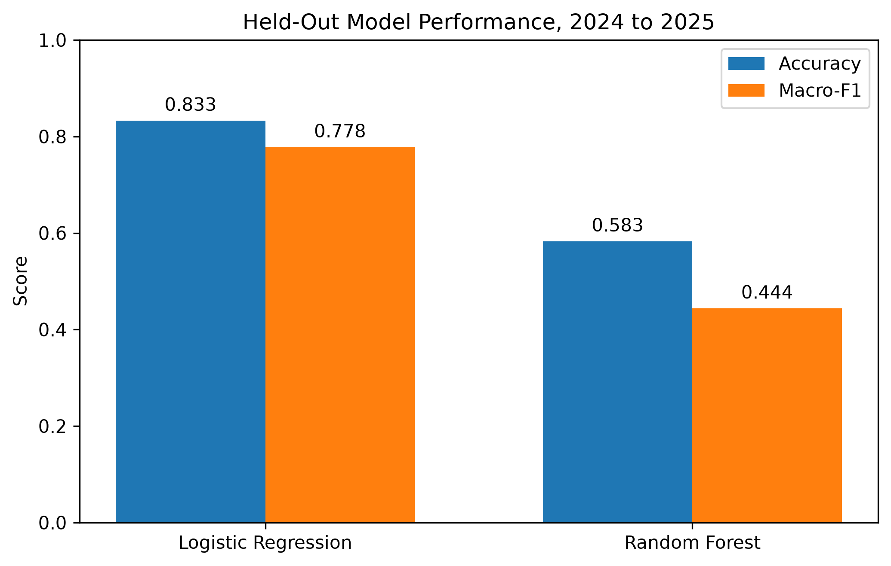
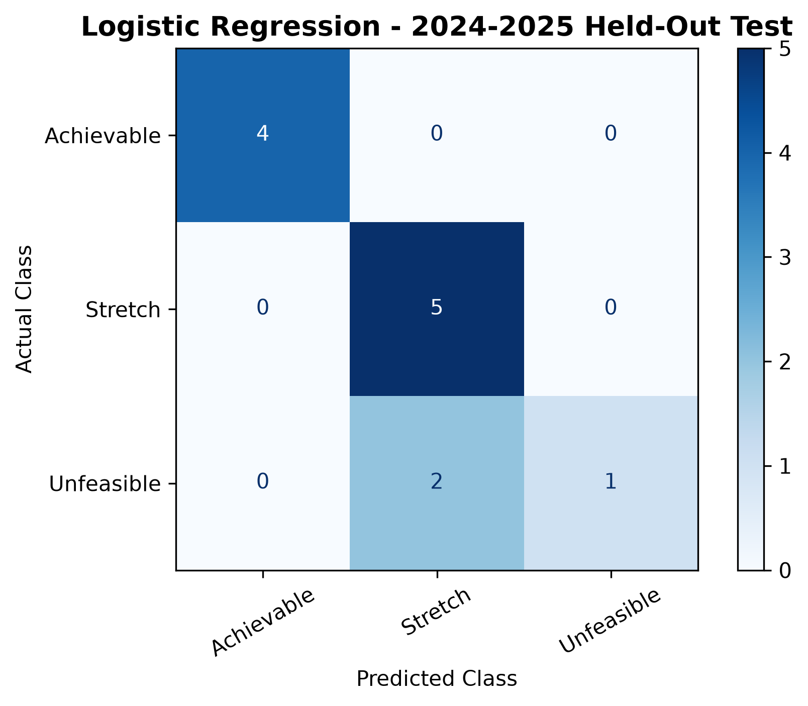
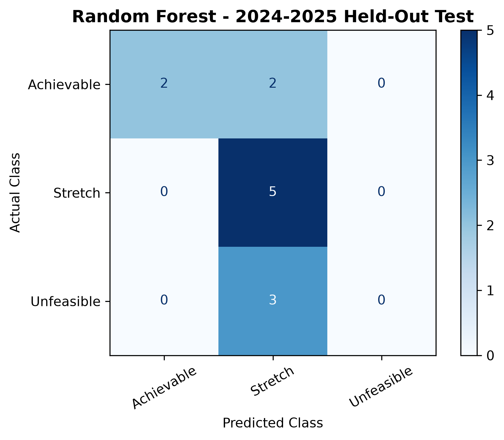
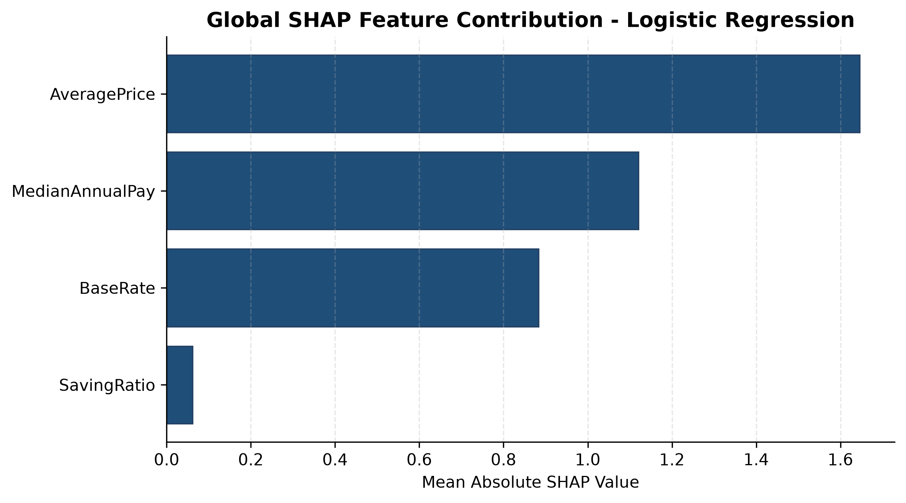
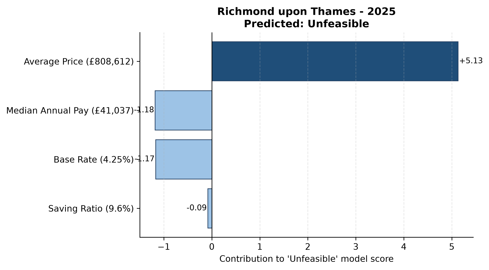

# Evaluation Results

This contains the main model-performance and explainability outputs from FundFirst. The final evaluation uses the held-out **2024–2025** period, containing **12 borough-year observations** that were not used during model selection.

## Model Comparison

  

| Model | Accuracy | Macro-F1 |
|---|---:|---:|
| **Logistic Regression** | **0.833** | **0.778** |
| Random Forest | 0.583 | 0.444 |

Logistic Regression provided the strongest performance on later unseen years while retaining a simpler and more interpretable model structure.

**Key finding:** added model complexity did not improve temporal generalisation on this dataset.

---

## Logistic Regression — Held-Out Test

  

The selected Logistic Regression model correctly classified:

- **4/4 Achievable**
- **5/5 Stretch**
- **1/3 Unfeasible**

This produced:

| Class | Recall |
|---|---:|
| Achievable | **1.00** |
| Stretch | **1.00** |
| Unfeasible | **0.33** |

The overall score therefore hides an important class-level weakness.

**Key finding:** the Unfeasible class is the main performance risk and requires substantially more evaluation before any operational use.

---

## Random Forest — Held-Out Test

  

Random Forest achieved lower overall performance and failed to correctly identify any Unfeasible observations in the final held-out period.

Its results support the decision to retain Logistic Regression as the final model.

---

## Global SHAP Explanation

  

Global mean absolute SHAP values:

| Feature | Mean Absolute SHAP |
|---|---:|
| **Average Price** | **1.646** |
| **Median Annual Pay** | **1.121** |
| **Base Rate** | **0.883** |
| **Saving Ratio** | **0.061** |

Average Price produced the largest overall contribution to model scores, followed by Median Annual Pay and Base Rate.

SHAP values explain model behaviour; they do **not** establish causal relationships.

---

## Example Local Explanation

  

For **Richmond upon Thames in 2025**, the model predicted **Unfeasible**.

Average Price made the strongest positive contribution to the Unfeasible model score, while other features pushed in the opposite direction.

This illustrates how local SHAP explanations can show why individual borough-year predictions differ even when the same feature set is used throughout the system.

---

## Additional Local Explanations

The repository also includes local SHAP explanations for:

- Croydon
- Kingston upon Thames
- Merton
- Sutton
- Wandsworth
- Richmond upon Thames

These plots show how feature contributions differ across individual held-out predictions.

---

## Fairness Audit

FundFirst also compares performance between higher- and lower-income borough groups.

The audit flagged:

- **33.3 percentage-point accuracy gap**
- **66.7 percentage-point Stretch-precision gap**

The predefined investigation threshold was **10 percentage points**.

These results are treated as **signals requiring investigation**, not evidence of discrimination or causation.

The audit is limited by:

- the 12-row final test set
- aggregate borough-level data
- income being used only as a socioeconomic proxy
- the absence of individual-level protected-characteristic data

---

## Assurance Summary

| Area | Evidence | Outcome |
|---|---|---|
| **Explainability** | SHAP generated for all 12 final predictions | Supported |
| **Reproducibility** | TSM labels reproduced consistently | Supported |
| **Performance** | 83.3% accuracy but Unfeasible recall of 0.33 | Partial |
| **Fairness** | Two gaps exceeded the predefined flag threshold | Flag raised |

FundFirst therefore provides useful assurance evidence, but the results also expose limitations that would require further investigation before real-world use.
